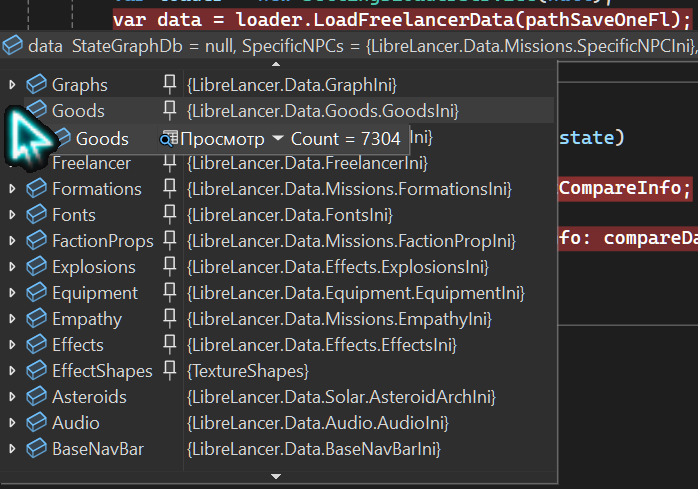

<h1 align="center">🌊 Freelancer Data Toolkit 🌊</h1>

<p align="center">
  <b>Reading, analysis, and serialization of Freelancer game data</b>
</p>

<p align="center">
  
  
  
  
  
  
  
  
</p>

<div align="center" style="margin: 20px 0; padding: 10px; background: #1c1917; border-radius: 10px;">
  <strong>🌐 Language: </strong>
  
  <a href="./README.ru.md" style="color: #F5F752; margin: 0 10px;">
    🇷🇺 Russian
  </a>
  | 
  <span style="color: #0891b2; margin: 0 10px;">
    ✅ 🇺🇸 English (current)
  </span>
</div>

---

> [!NOTE]
> This project is part of the **Lizerium** ecosystem and belongs to the following direction:
>
> - [`Lizerium.Tools.Structs`](https://github.com/Lizerium/Lizerium.Tools.Structs)
>
> If you are looking for related engineering and supporting tools, start there.

---

## 📌 About the Project

This repository contains **extracted and enhanced libraries** for working with _Freelancer_ game data, originally taken from the **LibreLancer** project and reworked into a standalone toolkit.

> The project no longer depends on LibreLancer and is maintained independently.

## Credits

> [!NOTE]
> This project is based on work from the Freelancer community.
> Reworked and integrated into Lizerium ecosystem.
>
> Contributors: [`CallumDev`](https://github.com/CallumDev), [`Lazrius`](https://github.com/Lazrius), [`smegulater`](https://github.com/smegulater), [`josbyte`](https://github.com/josbyte), [`mcgoober`](https://github.com/mcgoober), [`IrateRedKite`](https://github.com/IrateRedKite), [`bjstarosta`](https://github.com/bjstarosta), [`gp-alex`](https://github.com/gp-alex), [`JimJamJamie`](https://github.com/JimJamJamie), [`BC46`](https://github.com/BC46), [`Gnamra`](https://github.com/Gnamra), [`mrmbernardi`](https://github.com/mrmbernardi), [`HaydnTrigg`](https://github.com/HaydnTrigg), [`ananace`](https://github.com/ananace)

---

## ⚠️ Important

- This project is not intended for commercial use
- Core components were originally sourced from the open-source LibreLancer project
- Commercial use is at your own risk

---

## ✨ What it provides

With these libraries you can:

- 📂 Read the entire structure of a Freelancer game installation
- 🧠 Load all game data into memory
- 🔍 Analyze configurations (`freelancer.ini`, etc.)
- 🔁 Serialize game state into JSON
- 🧩 Work with mods (extended support included)
- ⚙️ Build your own tools:
  - Mod Manager
  - Data analyzers
  - Config generators
  - Testing environments

---

## 🚀 Quick Start

### 1) Add libraries

Build the project and reference:

- `Lizerium.Librelancer.DataBridge.dll`
- `LibreLancer.Base.dll`

(Prebuilt binaries are available in the `Releases` section)

---

## 📖 Example: Reading game data

```csharp
using LibreLancer.Data;

var freelancerPath = "C:\\Program Files (x86)\\Freelancer";

var vfs = LibreLancer.Data.IO.FileSystem.FromPath(freelancerPath);

var ini = new FreelancerIni(vfs);
var data = new FreelancerData(ini, vfs);

data.LoadData((msg) =>
{
    Console.WriteLine(msg);
});

Console.ReadLine();
```

### 💡 What you get

- `ini` → game configuration (`freelancer.ini`)
- `data` → **entire game loaded into memory** (structures, parameters, resources)

---

## 🧊 JSON Serialization

```csharp
var settings = new JsonSerializerSettings
{
    TypeNameHandling = TypeNameHandling.Auto
};

var json = JsonConvert.SerializeObject(data, settings);
File.WriteAllText("freelancer_dump.json", json);
```

---

## 🔄 JSON Deserialization

```csharp
var settings = new JsonSerializerSettings
{
    TypeNameHandling = TypeNameHandling.Auto
};

var json = File.ReadAllText("freelancer_dump.json");
var data = JsonConvert.DeserializeObject<FreelancerData>(json, settings);
```

---

## 🧠 Architectural Idea

The toolkit operates as:

```
Freelancer Folder → VFS → INI → Data Model → JSON / Runtime
```

- Virtual File System (VFS)
- Configuration parsing
- Full game model construction
- Further processing

---

## 🔥 Features

- Support for modded game versions
- Extended data loading
- Ability to create full game state snapshots
- Minimal entry point — literally **3 lines of code**

---

## 📦 Use Cases

This project is especially useful if you:

- develop Freelancer mods
- build analysis tools
- write server-side logic (FLHook / custom servers)
- want to automate working with game resources

---

## 📂 Screenshot

<p align="center">
  
</p>

---

## 📉 Status

The project is actively used as an **internal tool**, but may continue evolving.

---

## 📜 License & Origin

This project is based in part on code originally derived from the
[LibreLancer](https://github.com/Librelancer/Librelancer) project,
which is distributed under the [**MIT License**](LICENSE)

This repository contains extracted, adapted, and modified components used
for reading, parsing, and serializing Freelancer game data in a standalone form.

Original copyright belongs to:

- **Callum McGing, Librelancer Contributors (2013–2026)**
- **Malte Rupprecht (2011–2012)**
- **Mono.Xna Team (2006)**

All modifications and standalone toolkit integration in this repository
are maintained separately.

> [CREDITS](CREDITS.md)
